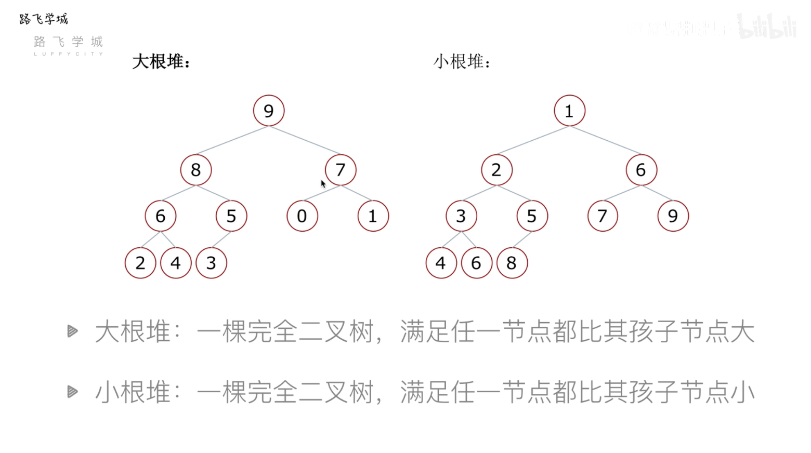

# 排序

## 常见的排序算法

## Low B 三人组

### 冒泡排序 Bubble Sort
- 列表每两个相邻的数，如果前面的比后面打，则交换这两个数
- 一趟顺序排序完成后，则无序区域减少一个数，有序区域增加一个数

```python
def bubbl_sort(li):
    for i in range(len(li) - 1): # 第I遍排序
        for j in range(len(li) - i - 1):
            if li[j] > li[j+1]:
                li[j],li[j+1] = li[j+1],li[j]
```

优化点：
如果某次循环，并无发生交换，说明列表的排序已经完成
```python
def bubble_sort(li):
    for i in range(len(ii) - 1):
        exchanged = False
        for j in range(len(li) - i - 1):
            if li[j] > li[j + 1]:
                li[j],li[j+1] = li[j+1],li[j]
                exchanged = True
                
        if not exchanged:
            return
```

### 选择排序

- 每一趟排序记录当前最小的数，放到无序区域的第一个位置
- 有序区和无序区，无序区最小数的位置

```python
def select_sort(li):
    for i in range(len(li) - 1):
        min_idx = i
        for j in range(i, len(li)):
            if li[j] < li[min_idx]:
                min_idx = j
        if min_idx != i:     
            li[i],li[min_idx] = li[min_idx],li[i]
```

### 插入排序 O(n ^ 2)

```python
def insert_sort(li):
    for i in range(1,len(li)):
        temp = li(i) # 无序区域每次的遍历的第一个
        j = i - 1 # 是有序区域的最后一个
        while j >= 0 and li[j] > temp: # 从右至左依次比较大小，比当前小的，则把当前右移一位
            li(j + 1) = li(i)
            j -= 1
        li[j + 1] = temp # 比当前大的，则放在右边
```

## NB 三人组

### 快速排序

快速排序的思路：
- 取第一个元素P（第一个元素）
- left\right左右两个下标位置，从right位置开始，找比P元素小的放在left的空位置，找到后，right变为空位置，然后从left开始寻找比P元素大的，放置在right位置，直至left与right相等
- 分为左右两边，左边left放比P元素小的，右边right放比P元素大的
- 递归完成排序

时间复杂度 O(n * log(n))

快速排序的问题：
1. 最坏情况-倒序排列数据
2. 递归

```py
# 快速排序
def partition(data, left, right):
    tmp = li[left]
    while left < right:
        while left < right and li[right] >= tmp: # 找到比tmp要小的元素
            right -= 1 # right左移一位
        li[left] = li[right] # 将找到的比tmp小的元素，放置在left的位置上
        
        while left < right and li[left] <= tmp: # 找到比tmp大的元素
            left += 1 # left右移一位
        li[right] = li[left] # 找到比tmp大的元素li[left]放置在right位置上
    li[left] = tmp
    return left # 此时left与right相等，返回当前下标

def quick_sort(data, left, right):
    if left < right:
        mid = partition(data, left, right)
        quick_sort(data, left, mid - 1)
        quick_sort(data, mid + 1, right)
        
```

### 堆排序
时间复杂度：O(n * log(n))
堆：一种特殊的完全二叉树结构
- 大根堆：一颗完全二叉树，满足任一节点都比其孩子节点大
- 小根堆：一颗完全二叉树，满足任一节点都比其孩子节点小



堆排序：堆的向下调整

1. 建立堆
2. 得到堆顶元素，为最大元素
3. 去掉堆顶，将堆的最后一个元素放到堆顶，此时通过一次向下调整重新使堆有序
4. 向下调整完成后，堆顶元素为第二大元素
5. 重复步骤3，直到堆变为空

构造堆：先从最后一个非叶子结点开始调整

先实现调整函数
```py
def sift(li, low, high):
    i = low # i初始指向根节点
    j = 2 * i + 1 # j初始位置指向根节点的左子节点
    tmp = li[low] # 把堆顶暂存
    while j <= high: # 说明j存在
        if j + 1 <= high and li[j+1] > li[j]: # 当右子节点存在，并且右子节点大于左子节点
            j = j + 1 # j取右子节点下标，即li[j]为左右子节点的最大值
        if li[j] > tmp:
            li[i] = li[j] # 当子节点大于tmp
            i = j # 继续往下一层调整
            j = 2 * i + 1 # 获取i调整后的j
        else: # tmp大于最大子节点，则跳出循环
            break
    li[i] = tmp # tmp放置在i的位置上
```
```py
def heap_sort(li):
    n = len(li)
    for i in range((n-2)//2, -1, -1): # 从最后一个非叶子节点开始
        sift(li, i, n - 1)
    for i in range(n-1, -1, -1):
        li[0], li[i] = li[i], li[0] # 堆顶与最后一个互换
        sift(li, 0, i -1) # 重新调整互换后的堆
```

> Python内置模块 -- heapq
> - heapify(heap) 构建堆，构建的是一个小根堆
> - heappush(heap, item)
> - heappop(heap) 每次弹出一个当前堆最小值

#### topK问题
1. 现在有n个数，设计算法得到前K大的数 k<n
解决思路：
    - 排序后切片 O(n* log(n))
    - 排序LowB三人组 O(k * n) 冒泡
    - 堆排序 O(n * log(k))

堆排序处理思路：
- 取列表前K个元素建立一个小根堆。堆顶就是目前第K大的数
- 依次向后遍历原列表，对于列表中的元素，如果小于堆顶，则忽略该元素，如果大于堆顶，则 将堆顶更换为该元素，并且对堆进行一次调整
- 遍历列表所有元素后，倒序弹出堆顶

```python
# sift函数要做更改，变为构建小根堆
def sift(li, low, high):
    i = low # i初始指向根节点
    j = 2 * i + 1 # j初始位置指向根节点的左子节点
    tmp = li[low] # 把堆顶暂存
    while j <= high: # 说明j存在
        if j + 1 <= high and li[j+1] < li[j]: # 当右子节点存在，并且右子节点大于左子节点
            j = j + 1 # j取右子节点下标，即li[j]为左右子节点的最大值
        if li[j] < tmp:
            li[i] = li[j] # 当子节点大于tmp
            i = j # 继续往下一层调整
            j = 2 * i + 1 # 获取i调整后的j
        else: # tmp大于最大子节点，则跳出循环
            break
    li[i] = tmp # tmp放置在i的位置上
def topk(li, k):
    heap = li[0:k]
    heapq.heapify(heap) # 构建小根堆
    for i in range(k, len(li) - 1):
        if li[i] > heap[0]:
            heap[0] = li[i]
            sift(heap, 0, k-1)
    for i in range(k-1, -1, -1):
        heap[0], heap[i] = heap[i], heap[0]
        sift(heap, 0, i-1)
    return heap
```

### 归并排序

分解：将列表越分越小，直至分成一个元素
终止条件：一个元素肯定是有序的
合并：将两个有序列表归并，列表越来越大

```py
def merge(li, low, mid, high):
    i = low
    j = min + 1
    ltmp = [] # 临时变量存放有序列表
    while i <= mid and j <= high:
        if li[i] > li[j]:
            ltmp.append(li[i])
            i += 1
        else:
            ltmp.append(li[j])
            j += 1
    while i <= mid:
        ltmp.append(li[i])
    while j <= high:
        ltmp.append(li[j])
        
    li[low:high + 1] = ltmp
```

```python
def merge_sort(li, low, high):
    mid = (low + high) // 2
    if low < high:
        merge_sort(li, low, mid)
        merge_sort(li, mid + 1, high)
        merge(li, low, mid, high)
```

### 其他

#### 希尔排序

#### 基数排序

#### 计数排序
