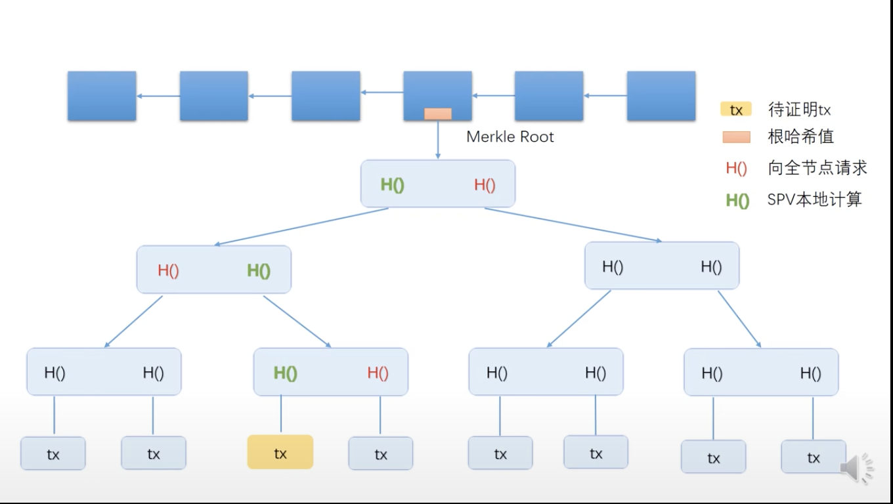

# BTC相关知识

区块链：一个一个block区块组成的链表

## BTC数据结构
hash pointers 哈希指针
- 保存hash结构体的地址以及该结构体的内容
- 指向下一个区块则使用的是哈希指针

第一个区块则被称为创世区块 genesis block
最后一个区块则为最近创建的区块 most recent block

A <- B <- C

C 指向 B的哈希指针则是由B的结构体内容以及指向A的哈希指针生成。

#### Merkle tree
- Merkle tree:
底层为数据块-data blocks，上层则为hash指针，两个data block的hash指针，再生成一个hash值，直至根节点。
任一data block发生改变，都会导致根节点hash值的变化
block由 block header和block body组成，block header保存有根节点的hash，交易信息则在body中存储

Merkle proof：从交易的data block的hash指针节点一直到根节点的路径,全节点会向轻节点返回图中对应的红色hash值，以便可以让轻节点一级一级计算并直至根节点，判断是否与header中保存的根节点hash是否一致

利用Merkle proof证明某个交易存在区块链中
proof of membership
proof of inclusion

hash指针还被应用与无环数据结构